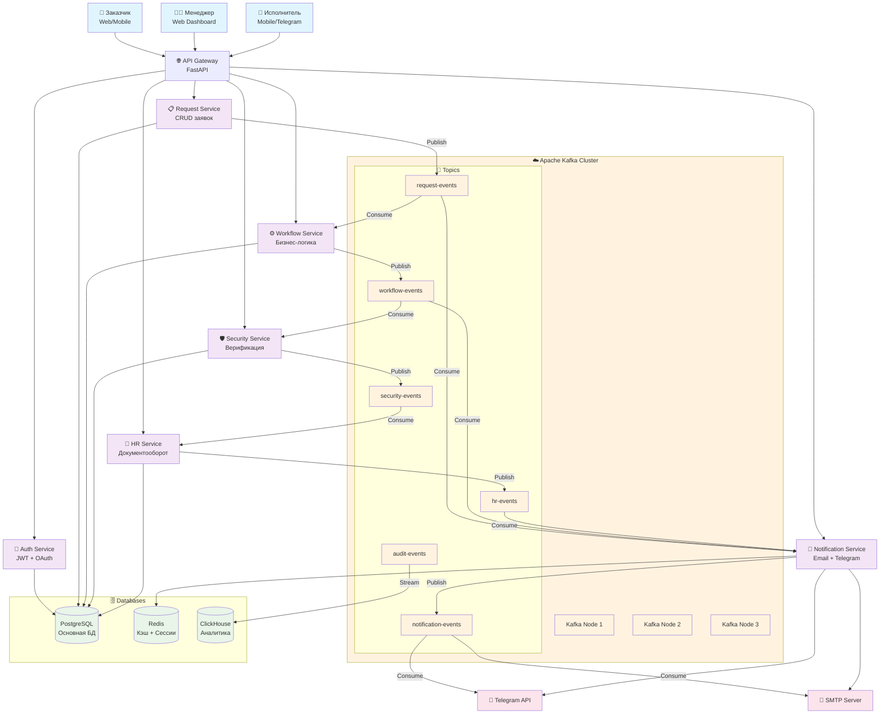

# 🚀 Архитектура агрегатора сервисных услуг с Apache Kafka

## 📊 Диаграмма архитектуры



## 🎯 Ключевые топики и события

### 1. `request-events` (Заявки)
**Partitions:** 6 (по регионам)
**Replication Factor:** 3
**Retention:** 7 дней

**События:**
- `request.created` - Создана новая заявка
- `request.updated` - Заявка обновлена
- `request.cancelled` - Заявка отменена
- `request.clarification_needed` - Требуется уточнение

### 2. `workflow-events` (Workflow)
**Partitions:** 3
**Replication Factor:** 3
**Retention:** 30 дней

**События:**
- `workflow.manager_assigned` - Назначен менеджер
- `workflow.sent_to_contractors` - Отправлена исполнителям
- `workflow.contractor_assigned` - Назначен исполнитель
- `workflow.work_started` - Работа начата
- `workflow.work_completed` - Работа завершена
- `workflow.status_changed` - Статус изменен

### 3. `notification-events` (Уведомления)
**Partitions:** 3
**Replication Factor:** 3
**Retention:** 3 дня

**События:**
- `notification.email.sent` - Email отправлен
- `notification.telegram.sent` - Telegram сообщение отправлено
- `notification.sms.sent` - SMS отправлено
- `notification.failed` - Уведомление не доставлено

### 4. `security-events` (Безопасность)
**Partitions:** 3
**Replication Factor:** 3
**Retention:** 90 дней

**События:**
- `security.contractor_verified` - Исполнитель верифицирован
- `security.contractor_rejected` - Исполнитель отклонен
- `security.access_granted` - Доступ предоставлен
- `security.access_revoked` - Доступ отозван

### 5. `hr-events` (HR)
**Partitions:** 3
**Replication Factor:** 3
**Retention:** 365 дней

**События:**
- `hr.document_created` - Документ создан
- `hr.document_signed` - Документ подписан
- `hr.contract_generated` - Договор сгенерирован
- `hr.payment_processed` - Платеж обработан

### 6. `audit-events` (Аудит)
**Partitions:** 6
**Replication Factor:** 3
**Retention:** 365 дней

**События:**
- `audit.user_action` - Действие пользователя
- `audit.system_event` - Системное событие
- `audit.error_occurred` - Ошибка системы
- `audit.performance_metric` - Метрика производительности

## 🔄 Критические сценарии на событийной модели

### Сценарий 1: Создание заявки
```python
# Синхронно: Сохранение в БД
request = create_request_in_db(data)

# Асинхронно: Публикация события
publish_event("request-events", {
    "event_type": "request.created",
    "request_id": request.id,
    "customer_id": request.customer_id,
    "urgency": request.urgency,
    "region": request.region,
    "timestamp": datetime.utcnow().isoformat()
})

# Consumer: Workflow Service
# - Автоматически назначает менеджера
# - Определяет приоритет обработки
# - Публикует workflow.manager_assigned

# Consumer: Notification Service  
# - Отправляет подтверждение заказчику
# - Уведомляет менеджера о новой заявке
```

### Сценарий 2: Назначение исполнителя
```python
# Синхронно: Обновление статуса
update_request_status(request_id, "assigned", contractor_id)

# Асинхронно: Публикация события
publish_event("workflow-events", {
    "event_type": "workflow.contractor_assigned",
    "request_id": request_id,
    "contractor_id": contractor_id,
    "manager_id": manager_id,
    "timestamp": datetime.utcnow().isoformat()
})

# Consumer: Notification Service
# - Отправляет уведомление исполнителю в Telegram
# - Отправляет email заказчику о назначении
# - Публикует notification.telegram.sent

# Consumer: Security Service
# - Проверяет доступ исполнителя к заявке
# - Логирует событие для аудита
```

### Сценарий 3: Завершение работы
```python
# Синхронно: Обновление статуса и сохранение результата
complete_request_in_db(request_id, completion_data)

# Асинхронно: Публикация события
publish_event("workflow-events", {
    "event_type": "workflow.work_completed",
    "request_id": request_id,
    "contractor_id": contractor_id,
    "completion_data": completion_data,
    "timestamp": datetime.utcnow().isoformat()
})

# Consumer: HR Service
# - Генерирует акт выполненных работ
# - Создает документы для оплаты
# - Публикует hr.document_created

# Consumer: Notification Service
# - Уведомляет заказчика о завершении
# - Отправляет отчет менеджеру
# - Публикует notification.email.sent
```

## 📈 Преимущества событийной архитектуры

### 1. **Масштабируемость**
- Независимое масштабирование сервисов
- Горизонтальное масштабирование через партиции
- Асинхронная обработка пиковых нагрузок

### 2. **Надежность**
- Гарантированная доставка сообщений
- Retry механизмы для failed событий
- Dead Letter Queues для проблемных сообщений

### 3. **Отказоустойчивость**
- Сервисы работают независимо
- Восстановление после сбоев через replay событий
- Graceful degradation при недоступности сервисов

### 4. **Мониторинг и отладка**
- Полная трассировка событий
- Централизованное логирование
- Метрики производительности в реальном времени

### 5. **Гибкость**
- Легкое добавление новых сервисов
- Изменение бизнес-логики без влияния на другие сервисы
- A/B тестирование через разные consumers

